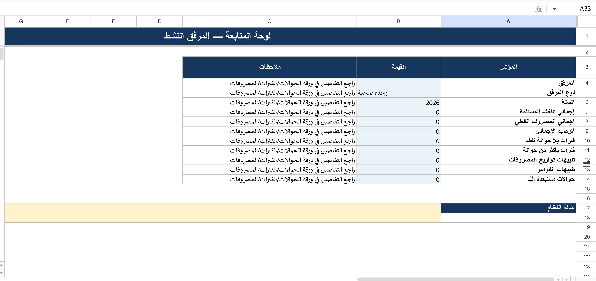
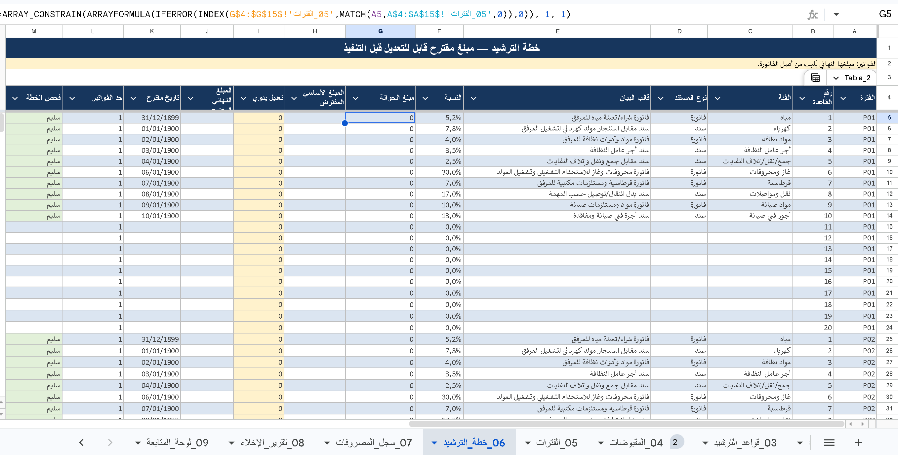
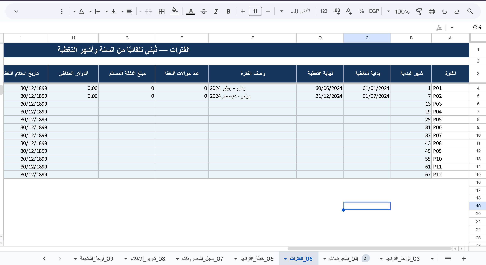
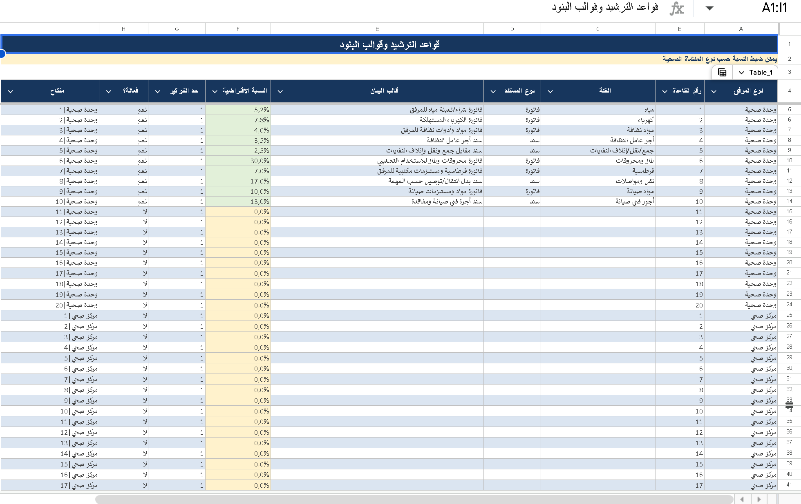

# Health Facility Expenditure Reporting Prototype
An AI-assisted Excel prototype developed to improve the organization and monitoring of operational expenditure reporting across multiple health facilities.
The project responds to common challenges in paper-based and fragmented reporting workflows, such as repeated manual calculations, limited traceability, and difficulty consolidating information across facilities. The prototype brings facility records, financial transfers, expenditure plans, actual spending, validation checks, alerts, clearance reporting, and dashboards into one structured workflow.
I defined the workflow requirements, guided the AI-assisted development, reviewed the formulas and outputs, corrected inconsistencies, and refined the workbook iteratively.
**Current stage:** Excel-based functional prototype  
**Tools:** Microsoft Excel • AI-assisted workflows • Data validation • Dashboards
### Dashboard

Facility-level monitoring dashboard summarizing expenditure status and reporting indicators.

### Expenditure Plan

Structured expenditure planning sheet linking budget lines, reporting periods, and facility-level allocations.
### Actual Expenses

Actual expenditure register designed to support transaction tracking and reconciliation.
### Facility Plan

Facility planning structure used to organize activities, allocation categories, and implementation status.